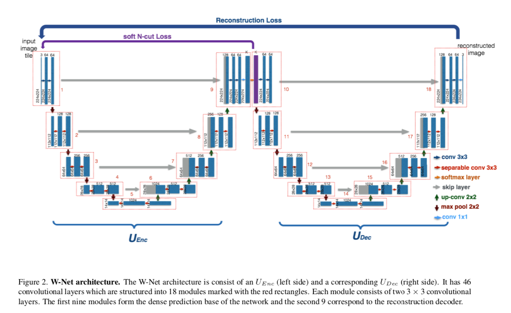

   
    
   
   

   <h3 align="center">Unsupervised Semantic Image Segmentation!</h3>

   The network is based on this paper https://arxiv.org/abs/1711.08506. 

   #### Abstract: 

   While significant attention has been recently focused on designing supervised deep semantic segmentation algorithms for vision tasks, there are many domains in which sufficient supervised pixel-level labels are difficult to obtain. In this paper, we revisit the problem of purely unsupervised image segmentation and propose a novel deep architecture for this problem. We borrow recent ideas from supervised semantic segmentation methods, in particular by concatenating two fully convolutional networks together into an autoencoder--one for encoding and one for decoding. The encoding layer produces a k-way pixelwise prediction, and both the reconstruction error of the autoencoder as well as the normalized cut produced by the encoder are jointly minimized during training. When combined with suitable postprocessing involving conditional random field smoothing and hierarchical segmentation, our resulting algorithm achieves impressive results on the benchmark Berkeley Segmentation Data Set, outperforming a number of competing methods.

   #### Network

